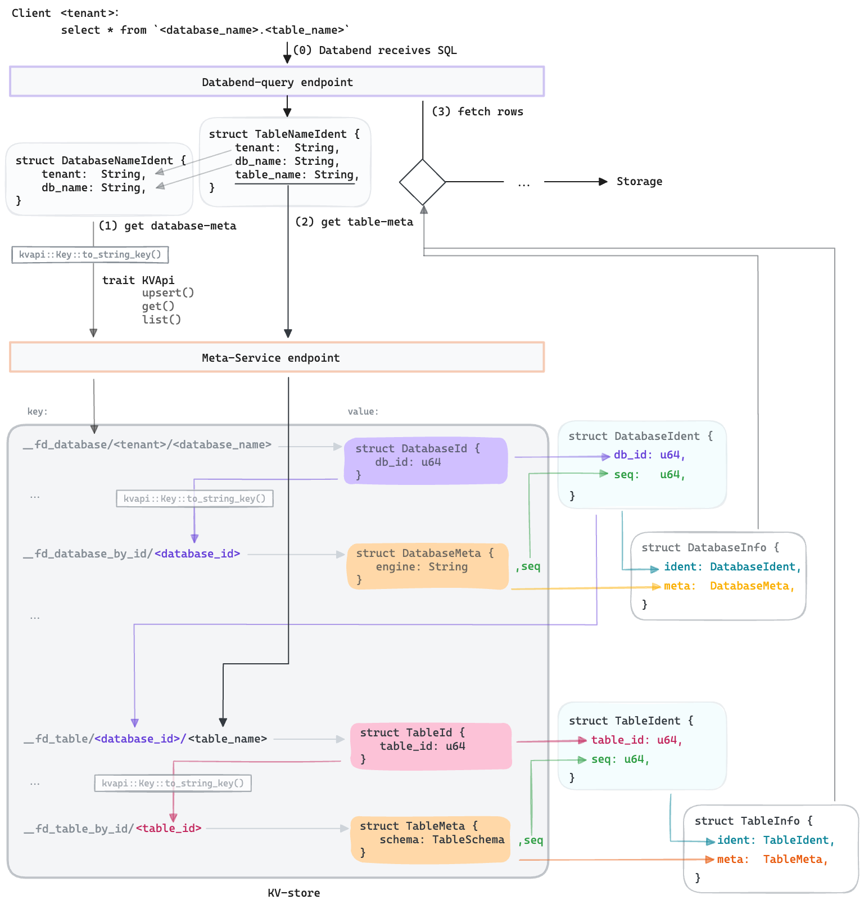

# Meta-service 数据结构


## 引言

[Databend][] 是一款开源的云原生数据库，采用 Rust 语言开发，专为云原生数据仓库的需求而设计。

1. 面向云架构：Databend 是完全面向云架构的数据库，可以在云环境中灵活部署和扩展 [简介 | Databend 内幕大揭秘](https://databend-internals.psiace.me/docs/getting-started/introduction/)。
2. 弹性扩缩容能力：Databend 提供秒级的弹性扩缩容能力，可以根据需求快速增加或减少计算资源。
3. 存算分离：Databend 实现了存储和计算的分离，可以独立增加计算节点而无需进行数据迁移，提高了计算资源的利用效率。
4. 共享存储：Databend 使用共享存储，可以方便地接入各种数据源，并支持 SQL 查询。
5. 弹性多租户隔离：Databend 的 Meta Service 层提供了弹性的多租户隔离的服务，可以满足不同用户的需求 [Databend：新一代云原生数仓的架构与展望 - 知乎](https://zhuanlan.zhihu.com/p/422928412)。

它的主数据以对象存储的形式存储在云端，而关键的元数据则托管在专用的 Meta Service 中。

本文旨在介绍 Meta Service 的基本数据结构组织方式，并阐述 Databend 中不同数据结构的功能及其相互关系。通过解读源码，我们展示了现代云数据仓库的构建细节，并探讨如何利用 Meta Service 的元数据来高效地操作 Databend，例如管理数据表（table）。

本文面向希望使用 Databend 数据库的用户，特别是那些愿意深入了解其内部机制以便更好地利用该数据库的用户。同时，本文也为有兴趣参与 Databend 开源项目贡献的人提供了宝贵信息。





## Databend 整体结构


Databend是一个开源的、完全面向云架构的新一代云数仓，它的系统架构包括以下组件：客户端、查询端点、元服务端点和KV存储。

1. 客户端：
   - Databend的客户端是用户与Databend系统进行交互的接口。
   - 客户端可以使用各种编程语言（如Rust、Python等）编写，以便用户可以根据自己的需求进行数据操作和查询。

2. Databend endpoint：
   - 它是Databend系统中处理查询请求的组件。
   - 它接收来自客户端的查询请求，并将其转发给适当的计算节点进行处理。
   - 查询端点还负责将计算节点返回的查询结果返回给客户端。

3. 元服务 meta-service：
   - 元服务端点是Databend系统中负责管理元数据的组件。
   - 它存储和管理表结构、用户认证信息等元数据。
   - 元服务端点还提供了事务性支持，用于保证数据的一致性和可靠性。

下面我们以一个简单的sql `select * from <database_name>.<tabe_name>`
的执行来介绍元数据的作用以及databend如何管理和使用元数据.


## Databend中的元数据key

在Databend这个数据处理系统中，我们掌握了三种关键的方式来追踪和管理数据资源，确保我们可以精确地操作这些资源。

首先，外部用户通常会使用一串可读的字符串名称来指代一个对象，比如一个数据库(database)或数据表(table)。这些名称可以随时更改，并且这样的变动不会影响到操作的准确性。在Databend系统的内部，我们通常需要多个字符串字段来唯一确定一个资源。例如，为了指定一个数据库，我们需要用到`<tenant>.<database_name>`这样的结构。我们把这些信息打包成一个结构体，比如 [`DatabaseNameIdent`][] 。

```rust
pub struct DatabaseNameIdent {
    pub tenant: String,
    pub db_name: String,
}
```

其次，对于系统内部来说，每一个资源都会被分配一个独一无二的整数ID来进行标识。这种ID，我们一般以 `xxxID` 的形式出现，仅在内部流转使用。Databend里的ID是对用户透明的，也就是说，用户通常不会接触到这些ID。在处理一个SQL请求的最初阶段，我们会把用户提供的字符串名称转换成这样的内部ID来使用，以此来避免名称变更可能带来的混淆。一个重要的规则是，一旦分配，这个对象的ID就永远不会变更，并且在全局范围内绝不会出现两个不同对象拥有相同的ID，不论这些对象是否类型相同。

例如 [`DatabaseId`][] 结构体：

```rust
pub struct DatabaseId {
    pub db_id: u64,
}
```

你可以看到，它实质上只是对一个`u64`类型的封装。我们这样做的目的是为了让不同类型的ID能够拥有不同的行为或属性。

最后，我们还有一种结合了 sequence number 的ID，用于标记资源的具体某个版本。这个序列号代表了资源的每一次变动。在 Databend 的内部，我们不仅使用唯一的ID来标识一个资源，还会进一步使用序列号来追踪该资源的特定变化。比如说，我们用表ID来唯一确定一个数据表。一个表的特定版本就是由其表ID加上序列号 `seq` 共同构成的。

这种结合ID和序列号的唯一标识符在 Databend 的内部操作中非常常见。当需要对元数据进行更新时，我们总是针对某个特定版本的资源进行操作，这样可以保证我们的修改是以原子方式进行的，即通过CAS（Compare-And-Swap）操作来确保数据一致性。

例如，[`TableIdent`][]  结构体就是用于操作特定版本的表的关键结构体。它确保我们的操作仅限于特定版本的 table：如果在我们读取数据和写入数据之间，table 的版本发生了变化（也就是seq改变了），我们的修改就会被拒绝。

```rust
pub struct TableIdent {
    pub table_id: u64,
    pub seq: u64,
}
```

通过这三种关键的识别方式，Databend能够高效而准确地管理其数据资源。


## Databend 元数据KV存储关键 trait

在Databend的世界里被称作meta-service的组件，可以把它想象成一个通过gRPC接口（一种编程接口）来访问的KV-store。而这个KV-store的接口是通过两个 trait 来定义的。

### Trait [`kvapi::Key`][]

在Databend中，我们对键值存储中的键（key）有着严格的结构定义。我们只使用结构化的键，比如 [`DatabaseNameIdent`][]，将它序列化为KV-store的 `String` key 的动作是由 trait [`kvapi::Key`][] 来定义的：

```rust
pub trait Key
{
    const PREFIX: &'static str;
    fn to_string_key(&self) -> String;
}
```

通过这个特性[`kvapi::Key`][]，Databend-query会把结构化的键（比如[`DatabaseNameIdent`][]）转换成字符串形式的key，例如`__fd_database/<tenant>/<database_name>`。然后，它会通过meta-service暴露的 [`KVApi`][] 来查询对应名称的数据库ID。

类似的，[`DatabaseId`][] 类型的键会被序列化为字符串类型的`__fd_database_by_id/<database_id>` key，以便在KV-store中检索[`DatabaseMeta`]数据结构。

### Trait [`KVApi`][]

[`kvapi::Key`][] 定义了 KV-store 的key的行为,
而 [`KVApi`][] 特性定义了访问KV-store 的 API：

它提供了非常基础的 key-value 修改和查询接口。所有更复杂的其他的元数据访问都是建立在这个 [`KVApi`][] 之上的：

```rust
pub trait KVApi: Send + Sync {
    async fn upsert_kv(&self, req: UpsertKVReq) -> Result<UpsertKVReply, Self::Error>;
    async fn get_kv(&self, key: &str) -> Result<GetKVReply, Self::Error>;
    async fn mget_kv(&self, keys: &[String]) -> Result<MGetKVReply, Self::Error>;
    async fn list_kv( &self, prefix: &str) -> Result<BoxStream<'static, Result<StreamItem, Self::Error>>, Self::Error>;
}
```

简而言之，Databend的元数据管理非常依赖于这些关键的特性来维持其结构化的存储和高效的数据检索方式，从而确保整个系统的数据管理既有序又高效。

## Databend中的元数据value简介

在Databend中，不仅 key 需要结构化定义，value 也同样需要严格的结构化定义。想象一下，我们的数据仓库是一个大柜子，里面的每个抽屉都用字符串标记，而抽屉里面放的都是二进制数据包。当我们想要存取这些数据包时，我们需要确切地知道每个数据包的内容和结构，这就要求我们用一个独特的结构体来代表这个值的结构，并在必要时将值序列化成二进制数据存储到数据仓库中。

在Databend中，我们使用 trait [`FromToProto`][] 来定义存储在KV-store中的value。简单来说，就是使用 protobuf 技术来帮助我们把一个结构体转换成一串`Vec<u8>`（也就是二进制数据），以及把这串数据再转换回原来的结构体。

```rust
trait FromToProto {
    type PB;

    fn get_pb_ver(p: &Self::PB) -> u64;
    fn from_pb(p: Self::PB) -> Result<Self, Incompatible>;
    fn to_pb(&self) -> Result<Self::PB, Incompatible>;
}
```

这个 [`FromToProto`][] trait 就像是一个翻译官，它描述了如何把我们用Rust语言写的数据类型转换成 protobuf 定义的数据类型，以及反过来的转换。

- `type PB`： 代表了与实现了 [`FromToProto`][] trait 的Rust类型相对应的 protobuf 类型。每次转换时，我们都会把Rust结构体转换成相应的 protobuf 格式，并处理可能出现的兼容性问题，最终将 protobuf 序列化成二进制数据存储在KV-store中。

- `fn get_pb_ver(p: &Self::PB) -> u64`：这个函数用来获取protobuf版本号，帮助我们在加载一个值之前处理版本兼容性问题。

- `fn from_pb(p: Self::PB) -> Result<Self, Incompatible>`：这个方法把protobuf类型转换回Rust类型。如果protobuf消息与Rust类型不匹配，转换可能会失败，此时会返回一个`Incompatible`错误。

- `fn to_pb(&self) -> Result<Self::PB, Incompatible>`：这个方法则是将Rust类型转换成protobuf类型。和`from_pb`一样，如果存在不兼容问题，这个转换也可能失败。

在Meta-service中，存储的值有不同的类型，比如 [`DatabaseMeta`][] 和 [`TableMeta`][] ，它们都实现了 [`FromToProto`][] 。

```rust
struct DatabaseMeta {
    engine: String,
    options: BTreeMap<String, String>,
    // ...
}
```

```rust
pub struct TableMeta {
    pub schema: Arc<TableSchema>,
    // ...
}
```

总而言之，Databend系统中的每个值都是精心设计的结构体，用来保持数据的一致性和准确性。通过 [`FromToProto`][] trait 的转换机制，我们能够保证数据在存储和检索时的完整性和可用性。这样的设计确保了系统在处理大量数据时的高效运行。


## 简单SQL执行背后的元数据管理：Databend中的Database查询深入解析

想象一下，你对着你的电脑或手机说：“给我看看这个数据库里都有什么。” 你其实就发起了一个SQL查询命令。在Databend这个大数据平台里，当这样的一个命令来临时，后台发生了一系列精妙的操作。今天，就让我们走进Databend的世界，看看执行一个简单的`select * from database_name.table_name` SQL命令背后，元数据是如何被使用和管理的。

### 查询Database

```
Client            Databend-query                Meta-service
+---------------->|                             |
         SQL      |                             |
                  +---------------------------->|
                  |  DatabaseNameIdent          |
                  |                             |
                  |<----------------------------+
                  |                 DatabaseId  |
                  |                             |
                  +---------------------------->|
                  |  DatabaseIdent              |
                  |                             |
                  |<----------------------------+
                  |               DatabaseMeta  |
                  |                             |
                 ...
```

#### 步骤一：提取查询信息


从SQL中提取`tenant` 和 `db_name`, 构造 [`DatabaseNameIdent`][], 用于对meta-service的查询.

```rust
pub struct DatabaseNameIdent {
    pub tenant: String,
    pub db_name: String,
}
```

#### 步骤二：首先通过name查询出id:

然后通过 trait [`kvapi::Key`][] 将这个结构化的key序列化成 `String` key:
`__fd_database/<tenant>/<database_name>`, 再通过 trait [`KVApi`][] 定义的接口访问 meta-service, 获得 [`DatabaseId`][]

```rust
pub struct DatabaseId {
    pub db_id: u64,
}
```

[`DatabaseId`][] 用于唯一定位一个database 对象, 即使数据库改名了，这个ID也不会变。

#### 步骤三：通过Id获取Database的档案

有了ID，现在查询服务就可以直接向元数据服务请求数据库的个人档案，也就是 [`DatabaseMeta`][]。

```rust
struct DatabaseMeta {
    engine: String,
    options: BTreeMap<String, String>,
    // ...
}
```

这一步也用类似于第一步的方式从meta-service中查找:
- 将结构化的key [`DatabaseId`][] 通过 [`kvapi::Key`][] 转换成 `String` key,
- 再通过 [`KVApi`][] 去 meta-service中查出 [`DatabaseMeta`][].


现在我们可以获得这个database对象的全局唯一版本了, 也就是 [`DatabaseId`][] 和
[`DatabaseMeta`][] 的 `seq` 组成的 [`DatabaseIdent`][] :

#### 步骤四：确保版本正确

为了保证信息的新鲜和准确，Databend会用一个 sequence number 来标记数据库的版本。这个 `seq` 和ID一起，组成了一个[`DatabaseIdent`][]，确保了信息是最新的且唯一的。

```rust
pub struct DatabaseIdent {
    pub db_id: u64,
    pub seq: u64,
}
```

在后续的操作中, 如果要对Database修改, 只会去修改这个版本(`seq`)的对象,
从而实现并发保护.

#### 最终：打包并送回

最后, 将 [`DatabaseIdent`][], 和 database 自身的信息
[`DatabaseMeta`][], 封装到一个 [`DatabaseInfo`][] 的结构体中返回给调用者.

```rust
pub struct DatabaseInfo {
    pub ident: DatabaseIdent,
    pub meta: DatabaseMeta,
}
```

这整个过程就像一个精心编排的接力赛，每一步都为了保证信息的准确性和安全性。通过这样的机制，Databend确保了即使在大量并发请求中，每一个数据的访问都是可靠和一致的。

就这样，你的一个简单查询，背后其实经过了一系列复杂的元数据传递和管理。现在，你已经了解了Databend中一个SQL查询背后的故事，下次当你看到数据库中的数据时，也许会对这背后的智慧有一个全新的认识。


## Table查询的技术解析

查询Table的过程在Databend中与查询Database的过程非常相似，但有其特有的细节。在查询Table时，我们首先利用从上一步获取的[`DatabaseId`][]信息。

由于每个Table都隶属于某个Database，元数据服务中存储Table的 key 会以[`DatabaseId`][]作为其前缀，格式如下：

```
__fd_table/<database_id>/<table_name>
```

通过这个键，我们可以检索到对应的[`TableId`][]，这是Table的唯一标识符。进而，我们利用[`TableId`][]来获取Table的元数据（[`TableMeta`][]）以及相关的序列号（seq）。序列号在此上下文中代表Table版本的唯一标识。

接下来，我们将[`TableId`][]和seq结合，构造出一个内部使用的唯一版本标识（[`TableIdent`][]）：

```rust
pub struct TableIdent {
    pub table_id: u64,
    pub seq: u64,
}
```

`TableIdent`代表了Table的特定版本，这对于确保一致性和处理并发更新至关重要。

最终，我们将[`TableIdent`][]和[`TableMeta`][]包装在[`TableInfo`][]结构中，返回给调用者：

```rust
pub struct TableInfo {
    pub ident: TableIdent,
    pub meta: TableMeta,
}
```

调用者接收到[`TableInfo`][]后，可以通过[`TableMeta`][]中的信息进行数据读取操作，或者基于[`TableIdent`][]指定的版本对Table进行更新操作。这是一个确保数据一致性和版本控制的重要流程，允许Databend在处理大规模并发数据操作时维护高效率和准确性。

## 总结

在本文中，我们深入探讨了在Databend中查询Table的内部工作机制。通过这一过程，我们了解了如何利用[`DatabaseId`][]来定位Table，并使用[`TableId`][]和[`TableMeta`][]来获取和操作Table的元数据。我们还学习了如何通过`seq`来追踪Table的版本，以及如何将这些信息封装在[`TableIdent`][]和[`TableInfo`][]结构中，以支持数据的读取和更新操作。

这一流程不仅体现了Databend强大的数据管理能力，也展示了其如何优雅地处理并发和维护数据一致性。无论是数据库管理员还是开发人员，理解这些基础的原理都是至关重要的，因为它们是构建高效和可靠数据服务的基石。

随着数据管理技术的不断进步，我们期待见证Databend及其查询机制如何继续演进，以满足不断增长的性能和可伸缩性需求。希望本文能够帮助你更好地理解Table查询的过程，为你在数据管理和应用开发的旅程中提供支持。

感谢你的阅读，希望你能在你的项目中应用这些知识，并且期待你对Databend和数据查询有更深入的探索。如果你有任何问题或想法，欢迎在评论中分享，让我们一起推动技术界的知识共享和进步。

[Databend]: https://www.databend.com

[`DatabaseNameIdent`]: https://github.com/datafuselabs/databend/blob/ad8f9d8f8755ff196b4161f1513accb87c7d21c7/src/meta/app/src/schema/database.rs#L30
[`DatabaseId`]: https://github.com/datafuselabs/databend/blob/ad8f9d8f8755ff196b4161f1513accb87c7d21c7/src/meta/app/src/schema/database.rs#L64
[`DatabaseIdent`]: https://github.com/datafuselabs/databend/blob/ad8f9d8f8755ff196b4161f1513accb87c7d21c7/src/meta/app/src/schema/database.rs#L58
[`DatabaseMeta`]: https://github.com/datafuselabs/databend/blob/ad8f9d8f8755ff196b4161f1513accb87c7d21c7/src/meta/app/src/schema/database.rs#L104
[`DatabaseInfo`]: https://github.com/datafuselabs/databend/blob/ad8f9d8f8755ff196b4161f1513accb87c7d21c7/src/meta/app/src/schema/database.rs#L51


[`TableNameIdent`]: https://github.com/datafuselabs/databend/blob/ad8f9d8f8755ff196b4161f1513accb87c7d21c7/src/meta/app/src/schema/table.rs#L70
[`TableId`]: https://github.com/datafuselabs/databend/blob/ad8f9d8f8755ff196b4161f1513accb87c7d21c7/src/meta/app/src/schema/table.rs#L124
[`TableIdent`]: https://github.com/datafuselabs/databend/blob/ad8f9d8f8755ff196b4161f1513accb87c7d21c7/src/meta/app/src/schema/table.rs#L43
[`TableMeta`]: https://github.com/datafuselabs/databend/blob/ad8f9d8f8755ff196b4161f1513accb87c7d21c7/src/meta/app/src/schema/table.rs#L217
[`TableInfo`]: https://github.com/datafuselabs/databend/blob/ad8f9d8f8755ff196b4161f1513accb87c7d21c7/src/meta/app/src/schema/table.rs#L171


[`KVApi`]: https://github.com/datafuselabs/databend/blob/ad8f9d8f8755ff196b4161f1513accb87c7d21c7/src/meta/kvapi/src/kvapi/api.rs#L48
[`kvapi::Key`]: https://github.com/datafuselabs/databend/blob/ad8f9d8f8755ff196b4161f1513accb87c7d21c7/src/meta/kvapi/src/kvapi/key.rs#L48
[FromToProto]: https://github.com/datafuselabs/databend/blob/ad8f9d8f8755ff196b4161f1513accb87c7d21c7/src/meta/proto-conv/src/from_to_protobuf.rs#L18-L17
